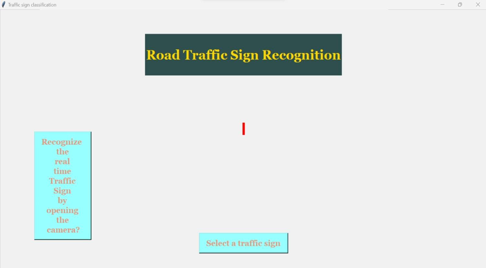

---
# Traffic Sign Recognition System

## Introduction

With the rapid growth in urbanization, road traffic has become increasingly complex. Drivers often miss or ignore traffic signs due to distractions or heavy traffic, contributing to the rising number of road accidents. According to statistics, around 400 road accidents occur daily in India, many of which could be prevented with timely recognition of traffic signs.

This project aims to develop a **Convolutional Neural Network (CNN)** model capable of detecting and classifying traffic signs from images. The system will alert drivers to the presence of traffic signs, helping reduce accidents and ensuring adherence to traffic rules. Such a system could serve as a crucial component for **autonomous vehicles** or advanced driver assistance systems (ADAS).

## Key Features

- **Traffic Sign Detection**: Recognizes and classifies traffic signs from images using CNN.
- **Real-time Alerts**: The system can assist drivers by detecting traffic signs and alerting them in real time.
- **Improves Road Safety**: Provides information about the upcoming road conditions and required actions (e.g., speed limits, danger zones).
- **Modular Design**: Three types of layers used in the model:
  1. **Convolution Layer**: Extracts features from input images.
  2. **Pooling Layer**: Reduces the dimensions of the feature map.
  3. **Fully Connected Layer**: Provides the final classification based on the extracted features.

## Modules Identified

- **Convolutional Neural Networks (CNN)**: 
  CNNs are the backbone of the system for image pattern recognition. CNNs are widely used in computer vision tasks, such as image classification, and are ideal for detecting traffic signs based on their shape, color, and other features.

- **Image Classification**:
  The CNN model classifies traffic signs into predefined categories based on their features, aiding in autonomous vehicle navigation and driver assistance.

## Tools & Technology Used

1. **Python**: Python is used as the primary programming language due to its extensive libraries for machine learning and data science.
2. **NumPy**: A core Python library for scientific computing, useful for operations on n-dimensional arrays and mathematical computations.
3. **Scikit-Learn**: Provides machine learning algorithms for classification, regression, and clustering.
4. **TensorFlow**: An open-source library for numerical computation, used to build and train the neural network model.
5. **Keras**: A high-level neural networks API, used to build and train CNN models efficiently.
6. **Jupyter Notebook**: An open-source web application to create and share code, visualizations, and documentation.

## System Requirements

### Software
- **Operating System**: Windows 8 or later
- **Programming Language**: Python 3.8
- **Browser**: Google Chrome for Jupyter Notebook

### Hardware
- **Processor**: Intel i5+ or AMD A8+
- **RAM**: 4GB or higher
- **Hard Disk Space**: 20GB

## Screenshots

Here are some screenshots of the project:


*Traffic Sign Recognition GUI.*


*Traffic Sign upload.*


*Resultant Traffic Sign Detected.*

## Installation

### Prerequisites
- Ensure Python 3.8 or higher is installed.
- Install required Python libraries:
   ```bash
   pip install numpy scikit-learn tensorflow keras jupyter
   ```

### Running the Project

1. **Clone the Repository**:
   ```bash
   git clone https://github.com/Traffic-Sign-Recognition-System.git
   ```
2. **Navigate to the project directory**:
   ```bash
   cd traffic-sign-detection
   ```
3. **Launch Jupyter Notebook**:
   ```bash
   jupyter notebook
   ```
4. Open the notebook file and run the cells to train and test the CNN model.

## How the Model Works

1. **Data Collection**: The model uses a dataset of traffic sign images for training and testing.
2. **Preprocessing**: Images are preprocessed (e.g., resized, normalized) before being fed into the CNN model.
3. **Training**: The CNN model is trained to recognize patterns in the images to classify them into different traffic sign categories.
4. **Prediction**: Once trained, the model predicts the type of traffic sign from an image input.

## Contributing

Contributions are welcome! Please fork the repository and create a pull request with your changes. If you find any bugs or have suggestions for improvements, feel free to open an issue.

